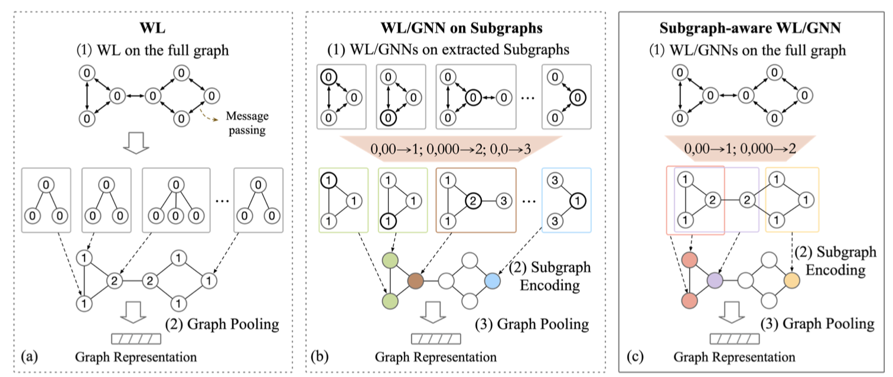

# Subgraph-aware-WL
Official code for [Towards Efficient and Expressive GNNs for Graph Classification via Subgraph-aware Weisfeiler-Lehman](https://openreview.net/pdf?id=ha9hPpthvQ)（LoG 2022）. (updating)

## Motivation

Figure 1.

## Illustration of fast SaWL

Figure 2.

## Requirements
> python=3.8  
> torch=1.10.0  
> PyG=1.7.2  
> OGB=1.3.1

## Usage

+ Test if two graphs are isomorphic, we take graph G and graph H in figure 2 as examples.
  > cd experiments  
  > python test_isomorphic_fast_sawl.py

+ fast SaWL algorithm is implemented in src/fast_SaWL.py

## Citation
If you find the code useful, please cite our paper:

> @inproceedings{wang2022towards,  
> title={Towards Efficient and Expressive GNNs for Graph Classification via Subgraph-aware Weisfeiler-Lehman},  
> author={Wang, Zhaohui and Cao, Qi and Shen, Huawei and Bingbing, Xu and Zhang, Muhan and Cheng, Xueqi},  
> booktitle={The First Learning on Graphs Conference},  
> year={2022}
}

## Contact
If you have any questions, please feel free to email me:  wangzhaohui18b@ict.ac.cn. 
